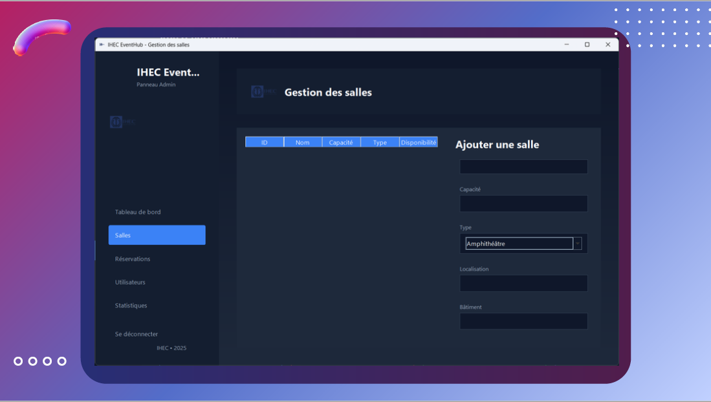
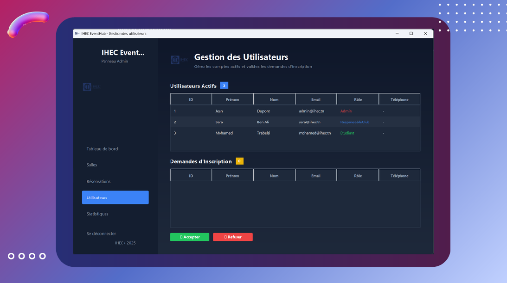
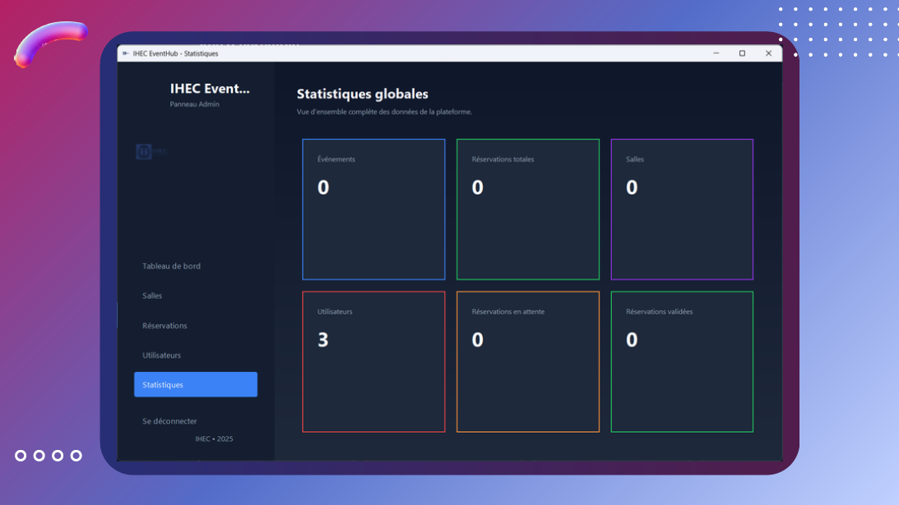
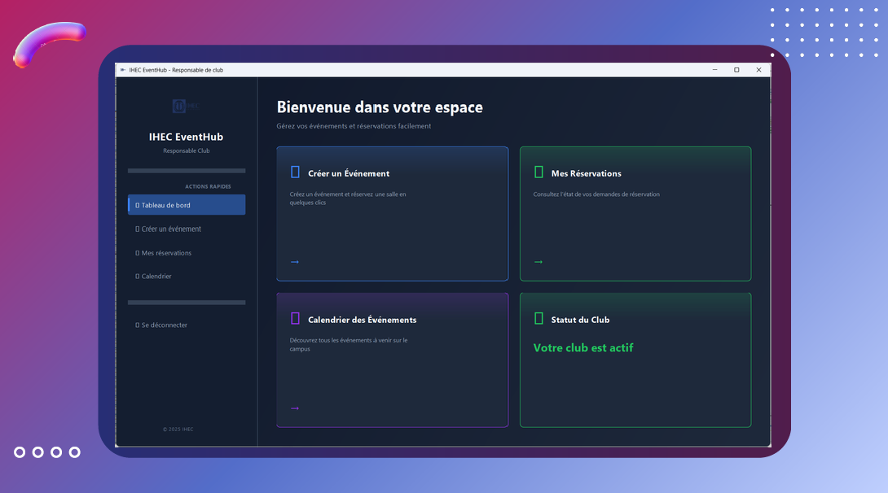
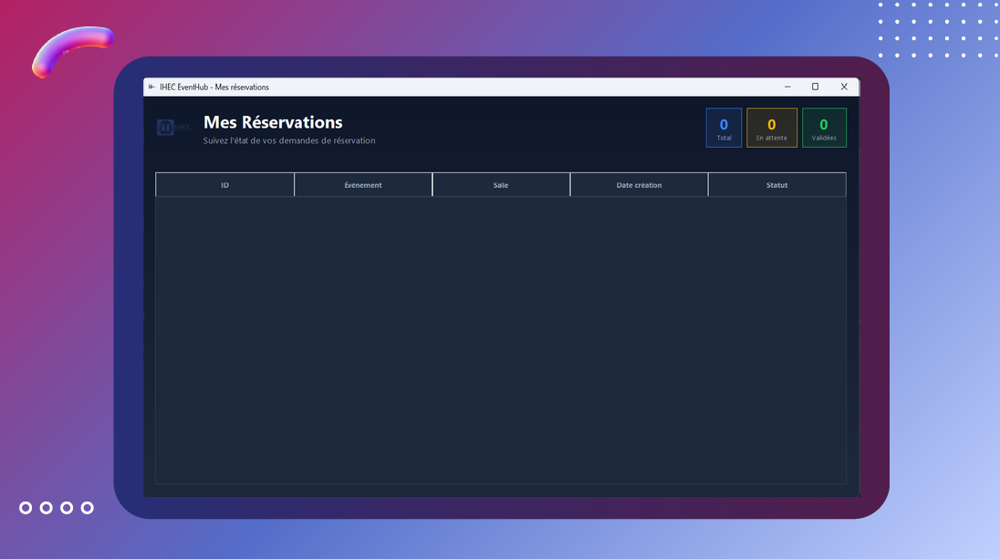
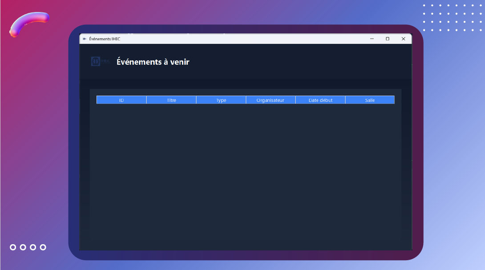
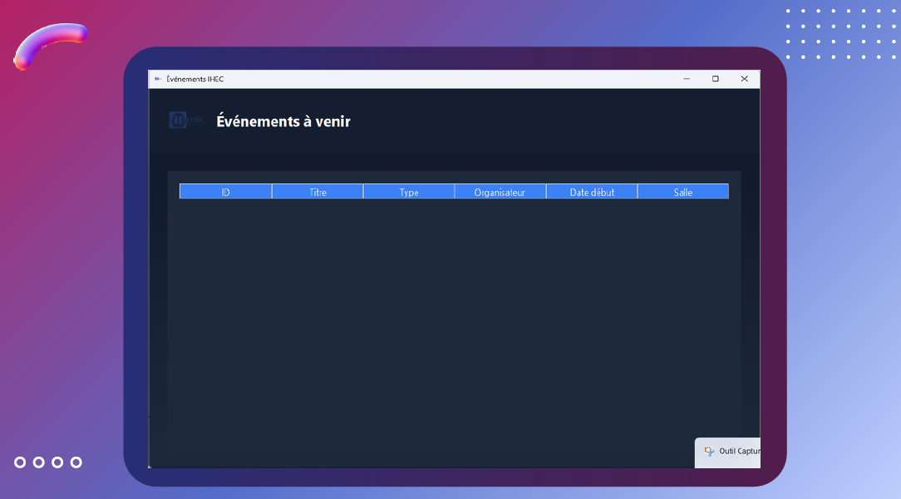
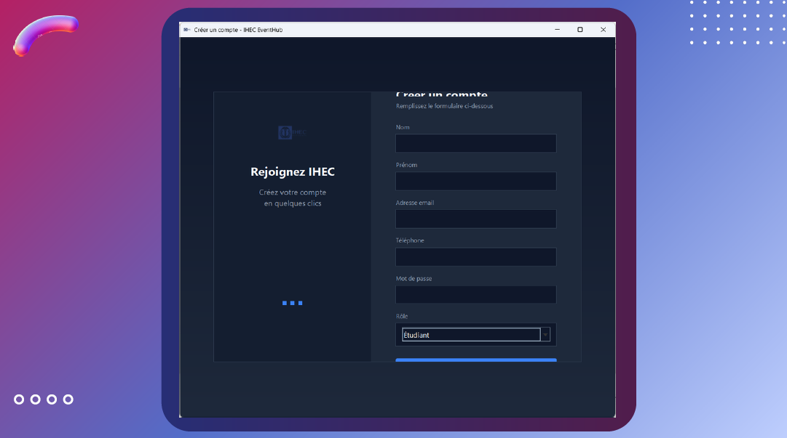

# IHECEventHub – Plateforme de gestion des événements et réservations

## Présentation du projet

IHECEventHub est une application de gestion des événements développée dans le cadre d’un projet universitaire à l’IHEC Carthage.  
Elle vise à centraliser et moderniser la gestion des événements organisés par les clubs étudiants et l’administration.

L’application permet de gérer efficacement les demandes d’événements, les réservations de salles et la validation administrative, tout en offrant une meilleure visibilité du calendrier global des activités.

---

## Contexte du projet

L’IHEC Carthage organise chaque année de nombreux événements tels que des conférences, compétitions, workshops et activités de clubs.

Actuellement :
- Les clubs réservent les salles pour leurs réunions et événements de manière régulière.
- La coordination entre l’administration, les clubs et les responsables d’événements se fait souvent manuellement (messages, feuilles Excel, formulaires dispersés).
- Cela provoque des conflits de réservation, des doubles bookings et un manque de visibilité globale.

Face à ces difficultés, l’IHEC souhaite centraliser et moderniser la gestion des événements et des réservations afin d’améliorer l’organisation générale.

---

## Objectifs du système

IHECEventHub a pour objectifs de :

- Fournir une plateforme centralisée pour gérer les événements au sein de l’IHEC.
- Permettre aux clubs et organisateurs de créer et soumettre leurs demandes d’événements.
- Faciliter à l’administration la validation ou le refus des réservations.
- Offrir une vision claire et organisée du calendrier global des activités.
- Réduire les erreurs de communication et éviter les conflits de dates.
- Moderniser le flux organisationnel grâce à une interface simple, efficace et intuitive.

---

## Idée du projet

L’idée du projet est de créer une application simple, moderne et centralisée permettant aux clubs de l’IHEC et à l’administration de gérer efficacement :
- Les événements
- Les demandes de salles
- Les validations administratives

Cette solution vise à remplacer les méthodes manuelles actuelles par un système informatique fiable et structuré.

---

## Justification

Aujourd’hui, la gestion des événements se fait souvent via WhatsApp, papier ou mails dispersés, ce qui entraîne :
- Confusion et perte d’informations.
- Difficulté pour les clubs à savoir quelles salles sont disponibles et à suivre l’état de leurs demandes.
- Perte de temps pour l’administration lors des vérifications manuelles, de la coordination et des réponses.

IHECEventHub permet d’améliorer :
- L’organisation
- La communication
- La transparence
- La rapidité de traitement des demandes

---

## Aperçu des fonctionnalités

### Réservation des salles

### Validation administrative

### Modification et gestion des événements

### Calendrier global des activités

### Gestion des utilisateurs

### Notifications et alertes

### Détails des demandes

### Paramètres de l’application

---

## Technologies utilisées

- Application développée dans le cadre académique
- Architecture orientée gestion des événements et des réservations
- Interface pensée pour les clubs étudiants et l’administration

## Documentation

Une présentation détaillée du projet est disponible dans le fichier PDF inclus dans ce repository.

---

